<h1 align="center">PTManager</h1>

  <b>소규모 매장의 근무 관리를 단톡방과 종이 근무표에서 앱 하나로 옮깁니다</b> 
  대타·근태·스케줄을 직원 앱 · 사장 앱이 공유하는 풀스택 팀 프로젝트

  
  
  
  

  <a href="https://github.com/PTManager/Backend">Backend</a> /
  <a href="https://github.com/PTManager/Frontend-Employee">Employee App</a> /
  <a href="https://github.com/PTManager/Frontend-Employer">Employer App</a>

---

## 프로젝트 소개 · 핵심 기능

  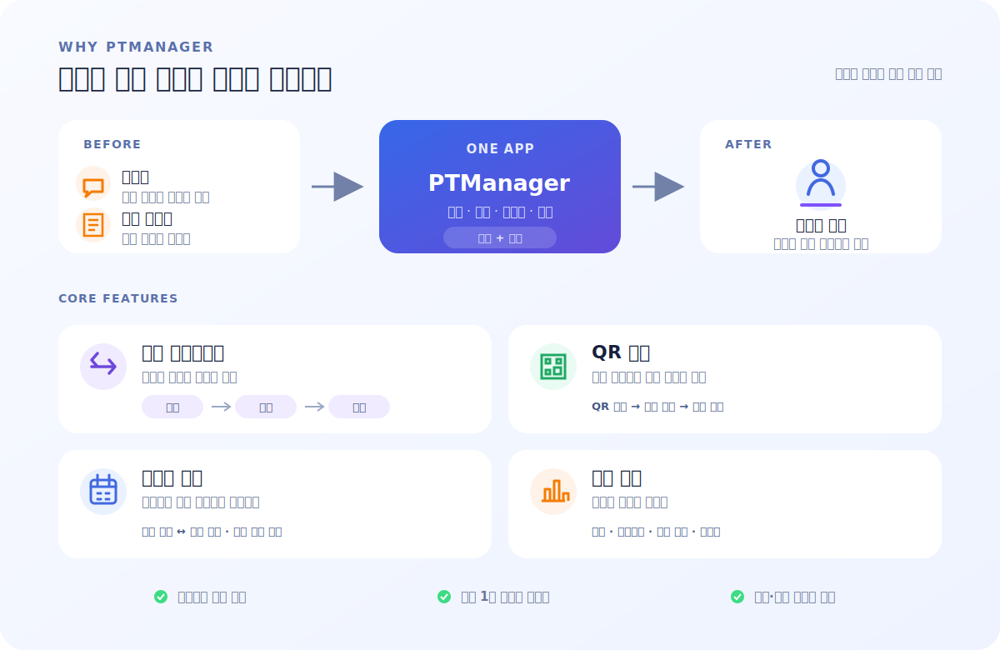

## 시스템 아키텍처

  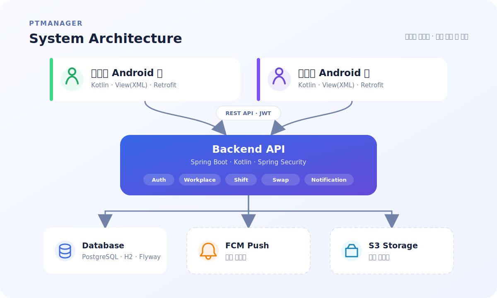

- 직원 앱 · 사장 앱이 **같은 백엔드를 공유**하고 JWT 토큰의 역할로 화면을 분리
- 백엔드는 도메인별 모듈 구성 (auth · user · workplace · shift · swaprequest · payroll · notice · joinrequest · notification)
- 운영은 PostgreSQL + Flyway, 로컬/테스트는 H2, FCM·S3는 설정으로 켜는 스텁 구조

## 앱 화면

### 직원용 앱

| 홈 | 스케줄 | 소통 | 통계 | 마이 |
|---|---|---|---|---|
| 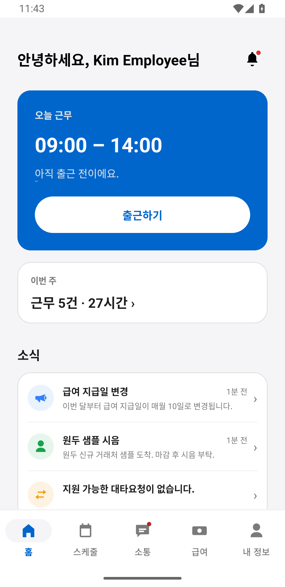 | 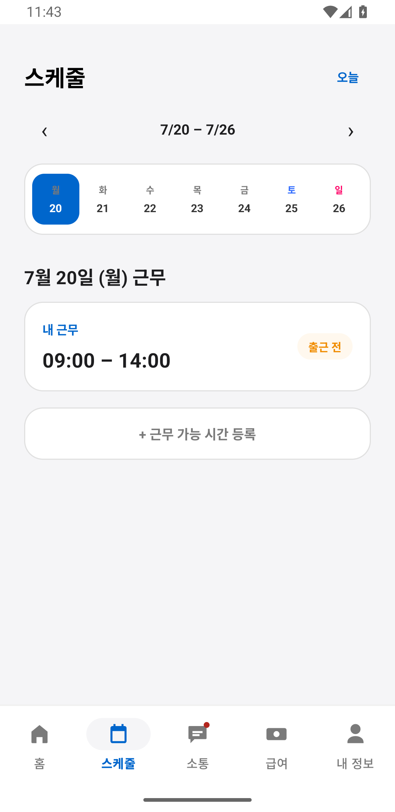 | 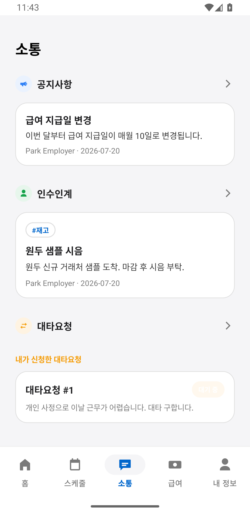 | 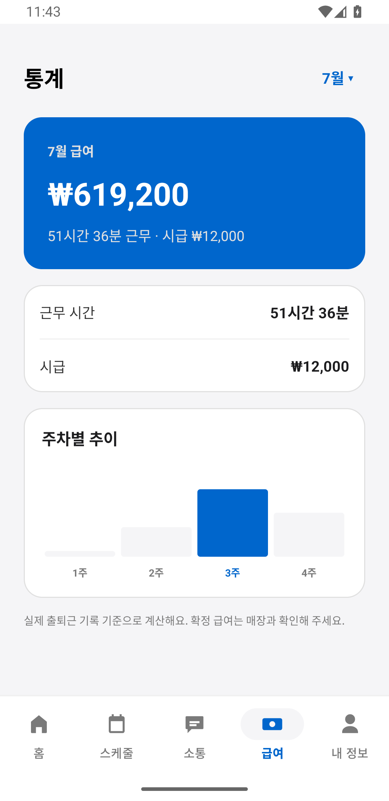 | 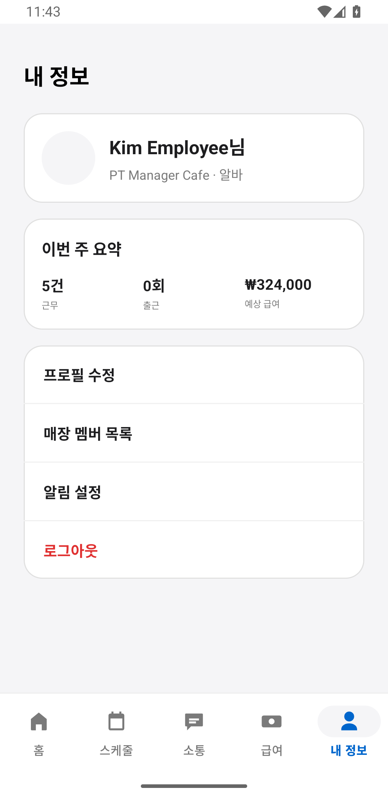 |

### 사장용 앱

| 홈 | 스케줄 | 소통 | 통계 | 마이 |
|---|---|---|---|---|
| 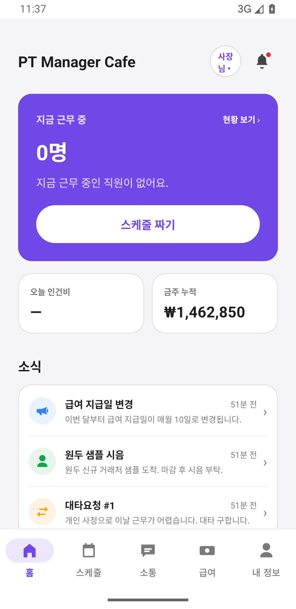 | 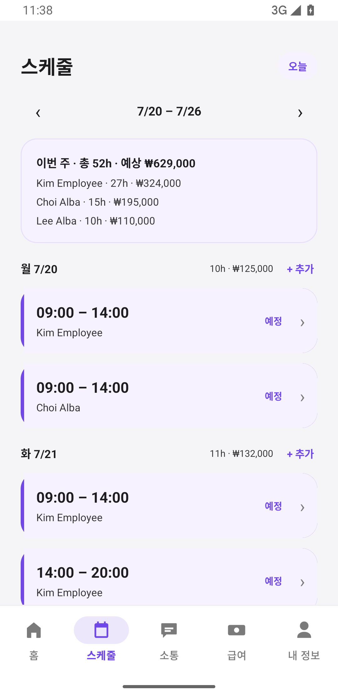 | 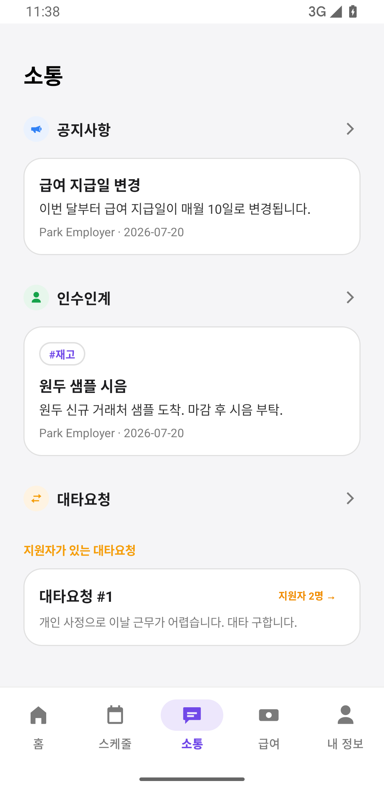 | 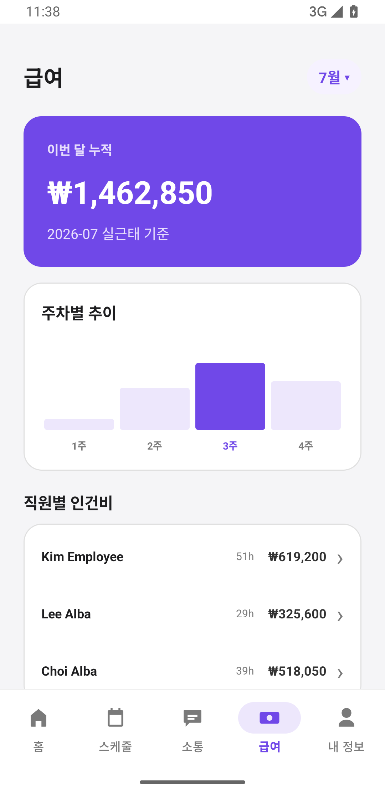 | 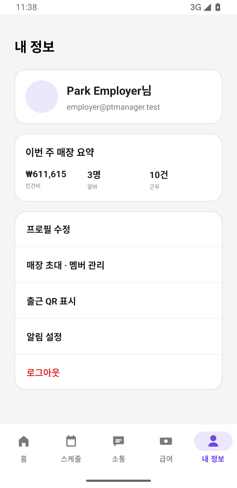 |

## 팀 구성

<table>
  <tr><td align="center"></td><td><b>정상겸</b> Leader · Full-stack</td><td>양쪽 앱 화면/API 연동 전반</td></tr>
  <tr><td align="center"></td><td><b>이동건</b> Full-stack · Infra</td><td>백엔드 코어 (인증·RBAC·REST API) · CI/CD</td></tr>
  <tr><td align="center"></td><td><b>김병수</b> Backend</td><td>회전형 QR · 공지 첨부파일</td></tr>
  <tr><td align="center"></td><td><b>정윤아</b> Frontend</td><td>직원용 앱 - 인수인계 노트 · 화면 디자인</td></tr>
  <tr><td align="center"></td><td><b>김채은</b> Frontend</td><td>사장용 앱 - 인수인계 노트</td></tr>
</table>
